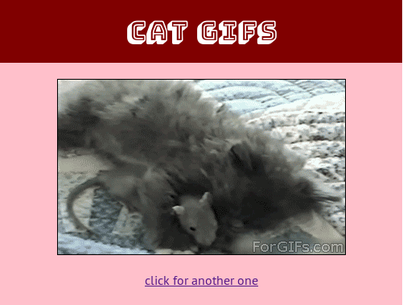

## catgifs

This is a Docker-contained Flask web app that displays random cat gifs.

### Usage

- Clone this repo: `git clone https://github.com/eightlimbed/catgifs.git`
- Build the Docker image (must have Docker installed): `docker build -t catgifs .`
- Start the app: `docker run -d --publish 8888:5000 catgifs`

You should now be able to view the app at `http://localhost:8888`
